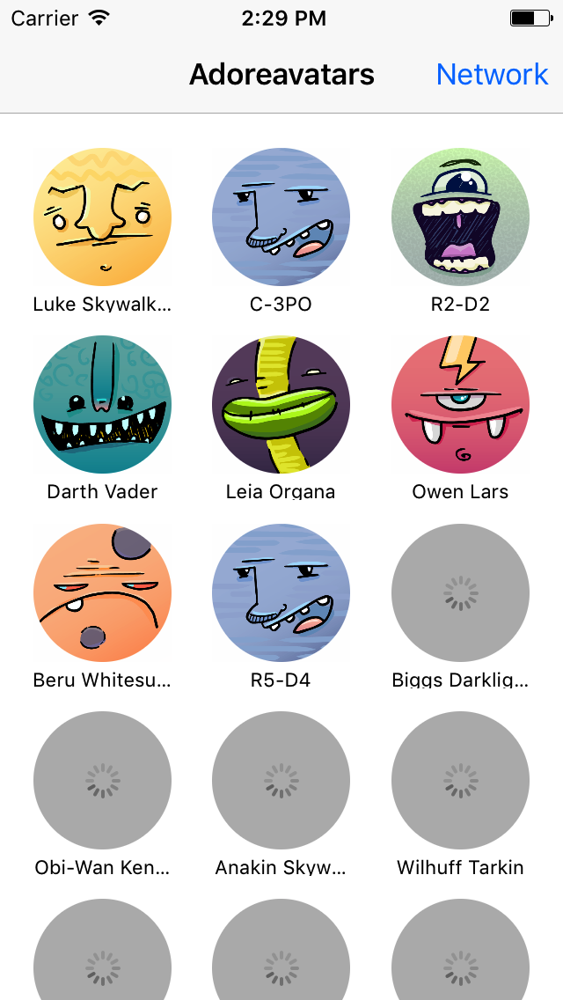
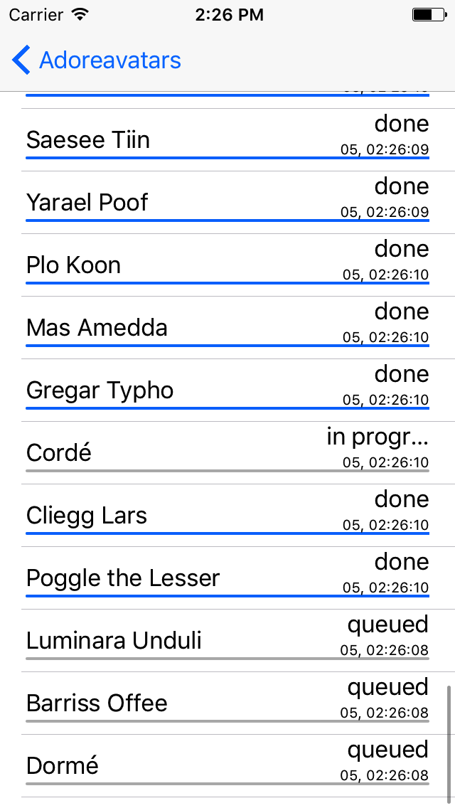

# Adoreavatars

This project was initially implemented by me while doing a code quiz at one interesting IT company. It was intended to be a simple two view
app with a collection view of avatars shown in the first view and a table view depicting all image downloads happening in the second view. 
The list of requirements for the avatar view included:
* activity indicator should be shown in the cell while the avatar download is in progress
* when avatar download is completed the image should be set for the image view and activity indicator should be dismissed
* if the download fail the cell should simply have gray background without activity indicator

The second view, which was supposed to provide the status and progress of each download initiated in the first view had to fulfill these requirements:
* the cell should contain the title of the avatar
* the cell should indicate the status of the assigned downlod (queued, in progress, done or failed)
* the cell should show the progress of the download
* the cell should depict the timestamp of the last modification of the download status

The main rule of that code quiz was to *implement all image downloading and caching without the use of third-party libraries* and caching needed
to be done only in the main memory without writting the images to disk.

The final project was also required to have some unit or/and integration tests implemented. Thus, for the coding I was allowed to use any library and
approach I prefer as well as the language: Obj-C or Swift. 

## RxSwift

As I've been digging into the world of FRP and specifically the RxSwift library, I thought it would be a great tool to apply and simplify 
a lot of asynchronous things here.

## URLSession

For the actual download of the images a URLSession and it's URLSessionDownloadTask were utilized. This way it was possible to track the 
download progress of the task and report it to the user with a progress indicator. 

## Caching 

According to requirements caching had to be organized only in the main memory resulting. The two possible solutions that came to my mind 
were to use the **URLCache** that could be set at the time of session init and the second one, more interesting way - by using RxSwift **shareReplay**
operator on task observer. ShareReplay operator would allow me to get the latest event from the observable on subscription even upon 
completion. URLCache approach however was much more flexible and allowed to persist the requests to disk if needed by simply changing its 
config. At the time when I was doing the code quiz due either to the lack of time and the pressure of the approaching submit deadline (I had
aproximately 4 hours) or for some other mysterious reason I have sticked to the first approach. Even now after a nice amount of the refactoring
the shareReplay operator still does the thing for me, even though the URLCache is hooked-up too.

## Adorable 

The API for this project was the [adorable](http://api.adorable.io) avatar API. This service provides avatar placeholder for web developers and designers and 
is easy to use due to the lack of any authorization/authentication. You can simply send a request with the avatar id in the url and it will
provide you with the image. 

## UI

Avatars view | Downloads view
:-------------------------:|:-------------------------:
  |   
